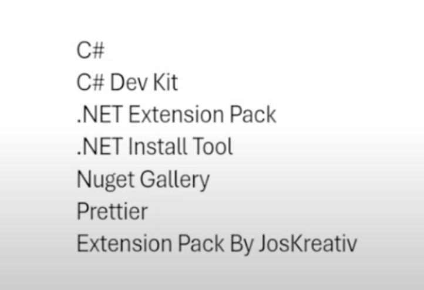

# Create a project folder
dotnet new webapi -o api 

- Purpose: create a project in dotnet
- Option: -o api   
  create a new folder api 

# To Start the project
dotnet watch run

# Program.cs file

# Some VS Code Extensions that makes life easier when using C# .Net

