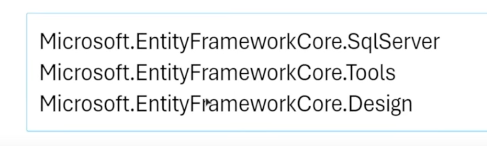

# Entity Framework is ORM in C#
Three things that is needed to be installed when using SqlServer with C# .Net

# dotnet tool install --global dotnet-ef
This is used to install dotnet-ef tool 

# dotnet ef migrations add init
Purpose of dotnet ef migrations add init

	1.	Database Schema Versioning: EF Core migrations allow you to evolve your database schema over time in a consistent and controlled manner. The init migration will capture the initial state of your model and create the corresponding database schema.

	2.	Schema Synchronization: When you run dotnet ef migrations add init, EF Core scans your application’s data model (defined by your DbContext and entity classes) and generates migration files that represent the SQL operations required to bring the database schema in line with your model.
	
    3.	Rollback and Forward Operations: Migrations provide a way to apply (dotnet ef database update) and revert (dotnet ef migrations remove) changes to your database schema. This is crucial for maintaining database integrity and supporting deployment scenarios where you may need to roll back to a previous version.

# dotnet ef database update 
This is used to apply the migration to the database

# The connection string for database: 
The connection string for the database is placed in the appsettings.json file

# Connecting to database in Program.cs
builder.Services.AddDbContext<ApplicationDBContext>(options => {
    options.UseSqlServer(builder.Configuration.GetConnectionString("DefaultConnection"));
});