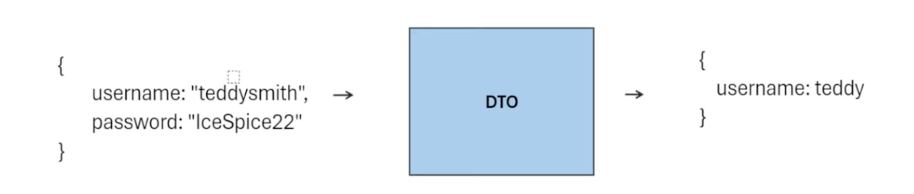

# What is DTOs
DTOs are data transfer objects

For example, if we have an object 
{
    username: "tung", 
    password: "123"
}

and we only want to return the username, then we can use DTO
{ username: "tung", password: "123"} -> DTO -> {username: "tung"}

# Mapper File 
Explanation of the Mapper File

A mapper file is used to transform data between different layers of an application. In this case, the StockMappers.cs file provides methods to convert between Stock entities (used in the data layer) and StockDto objects (used in the presentation layer or API layer). Here are the key reasons why a mapper file is important:

	1.	Separation of Concerns:
	•	Mappers help to separate the logic for data transformation from the business logic, making the codebase cleaner and easier to maintain.

	2.	Data Integrity:
	•	By defining explicit mappings, you ensure that data is accurately and consistently transformed between different representations, reducing the risk of errors.

	3.	Reusability:
	•	Mapping logic can be reused across different parts of the application. For instance, converting between entities and DTOs can be done in multiple controllers or services without duplicating code.

	4.	Encapsulation:
	•	Mappers encapsulate the transformation logic, making it easier to manage and update without affecting other parts of the code.

	5.	Testability:
	•	Having separate mapper functions makes it easier to write unit tests for the mapping logic, ensuring that the transformations are correct.

# Turn an db object into DTO object
1. DB object file: Stock.cs
2. DTO object file: StockDto.cs
3. Map from Stock to StockDto: using ToStockDto in the StockMappers file
4. Return it to client: use the controller in the stock controller file

